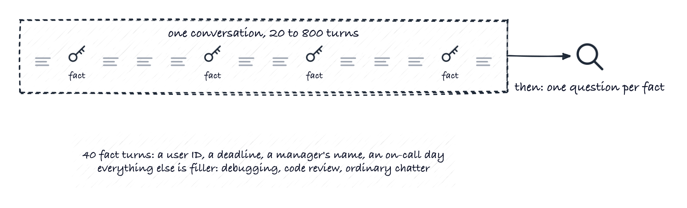
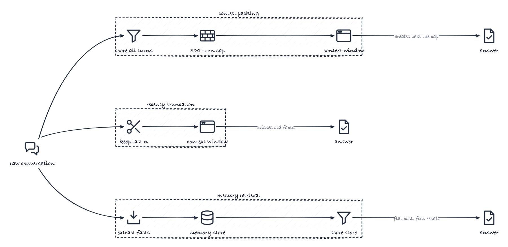
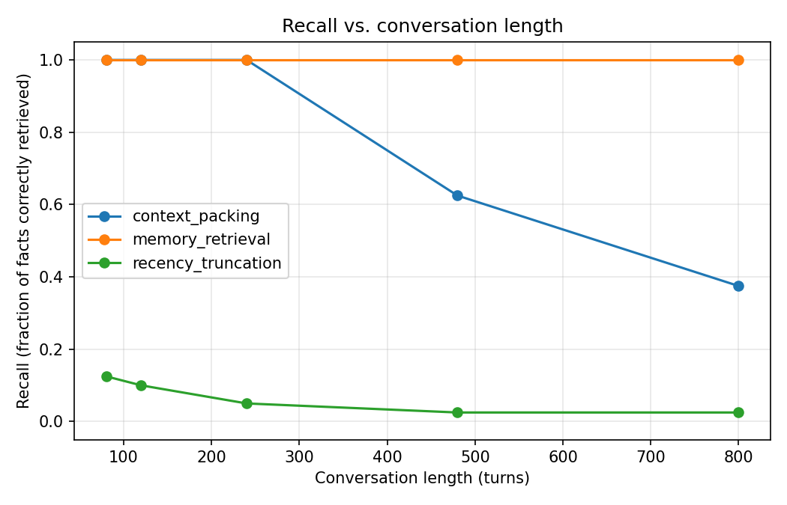
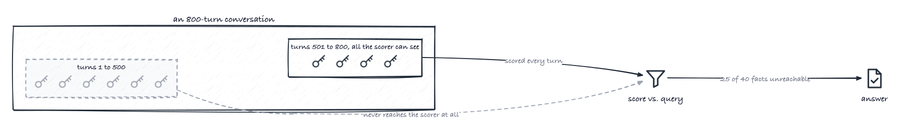
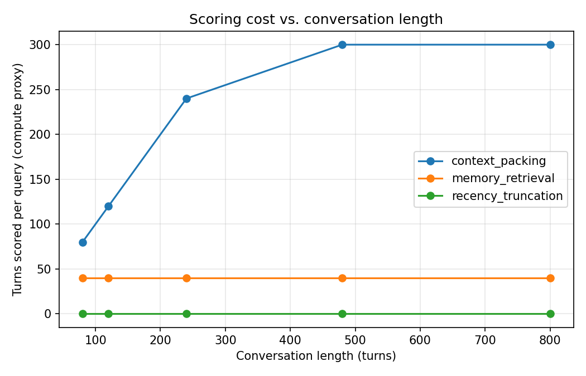
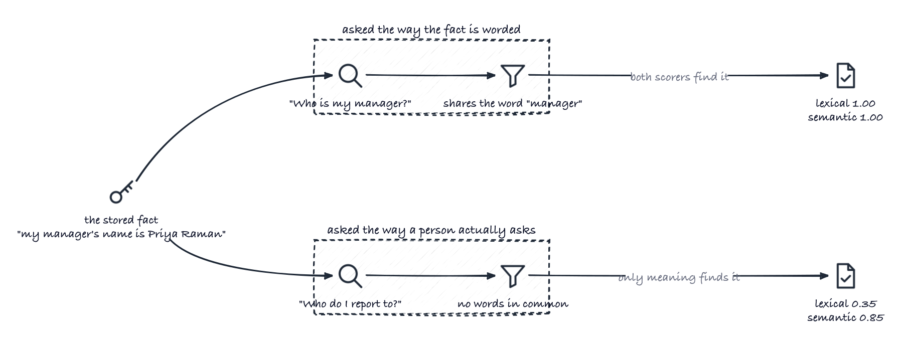

# Measuring the crossover from context engineering to agent memory

*Opinions are my own and don't represent my employer.*

There are active conversations in the field about whether "context engineering" and "agent memory" are the same thing under two names, or genuinely different problems. The usual framing: context engineering is a resource problem, where the context window is a fixed budget and the job is deciding what goes into it, while agent memory is closer to cognitive modeling, giving an agent something that persists and evolves across sessions. Atlan's survey of agent memory architectures supports the split, laying out five patterns that run from keeping everything in the context window, which is the most accurate but also the slowest and most token-hungry, through flat vector stores and tiered designs where the agent manages its own memory, each with its own accuracy and latency costs.

The distinction sounds right. What's missing is the boundary. If these really are different problems, there should be a point where packing the context window more cleverly stops working and a separate memory store starts being worth its complexity. That point should be findable, and it should be possible to say what causes it.

Below is a small test that attempts to locate it, what it found, and the guidelines that follow from it.

## The scenario

Picture a long working session with an assistant. Most of it is ordinary: debugging a stack trace, reviewing a SQL query, asking how to set up a virtual environment. Along the way the user mentions things in passing. Their employee ID. Who their manager is. The budget code for the project. What time the backups run. Each one is said once and never repeated.

Much later, they ask about one of those things. Who is my manager? What's the budget code?

The question is whether the system can still answer, and what it costs to keep being able to.

## The numbers that define the test

Five constraints set up the whole experiment, so they're worth stating before anything depends on them.

**40 facts.** Each is mentioned once, spread evenly through the conversation, with everything between them being ordinary work chatter.

**Conversation length from 80 to 800 turns.** This is the variable being swept. Everything else stays fixed.

**A 120-token budget.** This is the space available for assembled context when answering a question. It stands in for the context window. Real windows are far larger, but real conversations are far longer too, and what matters here is the ratio between what you have to remember and what you can hold at once.

**A 300-turn scoring cap.** Two of the three approaches below work by scoring: taking the question, comparing it against each candidate turn, and keeping whichever turns look most related. This cap is the most history that can go into one of those passes. Every system hits a ceiling like this eventually, whether it comes from a context limit on the model doing the scoring, or simply the cost of re-ranking a history that grows every turn.

**Recall.** A question counts as answered if the turn containing the fact made it into those 120 tokens. Alongside it, the test tracks turns scored per query, as a stand-in for compute.

The conversation is synthetic rather than real, so that exactly one thing varies: how far back the answer lives. Real transcripts vary in a dozen ways at once. The scoring uses TF-IDF similarity rather than a model. TF-IDF ranks a turn by how many of the question's less common words it contains, so "budget code" counts for far more than "the". It keeps the whole thing offline and identical on every run. Whether that last choice changes the conclusion is a fair question, and is tested directly further down.

## The three approaches

**Recency truncation** keeps the most recent turns until the budget runs out. Here there is no scoring or logic. It's the baseline anything real should beat.

**Context packing** is my label for what context engineering usually means in practice: score the whole conversation history against the question, then pack the best-matching turns into the budget until it's full. This is a real technique and not a strawman, which matters for the comparison to mean anything.

**Memory retrieval** pulls fact-bearing turns into a small external store as the conversation happens. At question time, only that store gets scored, not the raw conversation.

The part doing the pulling is the *extractor*. It's the write half of a memory system: something that watches the conversation go by and decides what is worth keeping. In production that decision is usually made by an LLM asked, in effect, "is there anything here we'll want later?". In this harness it doesn't decide anything, because the fact-bearing turns were tagged when the conversation was generated and the extractor just pulls those. That makes it a best case rather than a realistic one, which matters enough that it gets measured separately further down.

## Numbers that decide whether any of this means anything

Two of those five settings determine whether the test measures retrieval at all. Both fail quietly, producing clean and entirely meaningless numbers, so they are worth checking in any retrieval evaluation and not just this one.

**The fact store has to be bigger than the budget.** Forty facts come to roughly 434 tokens, so at most a dozen fit in the 120 available and something has to choose which. Ten facts would have come to 113 tokens, and the whole store would have fitted every time. That sounds harmless. It isn't. It means the memory approach never retrieves anything: it includes everything, and scores a perfect 1.0 because there was nothing to get wrong. The number just looks excellent. The check that catches this takes seconds and is worth running against any retrieval system: give it a query that should match nothing, and see whether it still hands back everything.

**A hit has to mean the right thing.** The obvious way to score a hit is to look for the expected answer somewhere in the assembled text. But "IST", the timezone fact, is a substring of "list", and one of the ordinary turns asks about the difference between a list and a tuple in Python. Facts could count as found off a turn that had nothing to do with them. Hit detection has to match the unit you actually retrieved, not a string that might appear inside anything. Tightening it makes every approach score worse, which is the direction a correct fix moves results.

## What the numbers show

| conversation_length | approach | recall | avg_turns_scored |
|---:|---|---:|---:|
| 80 | context_packing | 1.000 | 80 |
| 80 | memory_retrieval | 1.000 | 40 |
| 80 | recency_truncation | 0.125 | 0 |
| 240 | context_packing | 1.000 | 240 |
| 240 | memory_retrieval | 1.000 | 40 |
| 240 | recency_truncation | 0.050 | 0 |
| 480 | context_packing | 0.625 | 300 |
| 480 | memory_retrieval | 1.000 | 40 |
| 480 | recency_truncation | 0.025 | 0 |
| 800 | context_packing | 0.375 | 300 |
| 800 | memory_retrieval | 1.000 | 40 |
| 800 | recency_truncation | 0.025 | 0 |

Recency truncation is not great from the start, at 0.125 recall by 80 turns and 0.025 by 800. With 40 facts spread across a long history and room for a dozen, the most recent turns almost never hold the one being asked about.

Context packing is the interesting one, and it is genuinely strong. As long as the history fits inside the scoring cap, it gets every question right, out to 240 turns. So the argument that good context engineering is sufficient, holds up to this point.

But then it starts breaking. At 480 turns recall falls to 0.625, and at 800 turns to 0.375.

## Why it breaks matters more than that it breaks

The failure isn't that the ranking gets worse. It's that the information isn't there to be ranked.

At 800 turns with a 300-turn cap, 25 of the 40 facts sit in the first 500 turns, outside the window the scorer ever sees. Those facts aren't scored and rejected and were never real candidates. The 15 that are still inside the window are exactly the 0.375 it scores.

That's the difference between a system that degrades and one that goes blind. A ranking problem improves with a better ranker. However, in this case nothing you do to the scoring step reaches a turn that was never handed to it.

There's a usable rule buried in those two numbers. Once the conversation is longer than the cap, recall lands at roughly the cap divided by the length. At 480 turns, 300/480 is 0.625. At 800 turns, 300/800 is 0.375. It implies that the share of facts you can still reach, is the share of the conversation you can still see.

That is worth more than the measurement itself, because you can apply it to your own system without running anything. Take the history you would need to search, divide by how much you can afford to score per turn, and you have your expected recall. It assumes facts are spread evenly, which is usually too good to be true. Real conversations are recency-weighted, so treat it as a floor rather than a forecast.

Memory retrieval holds perfect recall at every length, and its cost stays flat at 40 turns scored whether the conversation is 80 turns or 800, because the store it searches doesn't grow with the conversation. That result is earned rather than free: the store is about 3.5 times the budget, so the right fact has to be ranked into the top 12 out of 40, every time.

That cost gap is not an artifact of this harness. Mem0's LOCOMO evaluation compares a memory system against a full-context baseline that feeds the entire conversation history to the model, and reports 91% lower p95 latency and over 90% lower token cost for the memory approach. In the reported figures the full-context baseline is still the more accurate of the two, at roughly 73% against 67%. That is the same trade-off measured on real conversations rather than synthetic ones: holding everything in the window answers better, and costs an order of magnitude more to do.

What the harness here adds is the part that comes after. Once the history no longer fits into a single scoring pass, holding everything in the window stops being the more accurate option as well as the more expensive one, because most of it is no longer being looked at.

## Does the choice of scorer change this?

TF-IDF matches on shared words. A real embeddings model matches on meaning, and can find a fact worded nothing like the question. That sounds like it should matter a lot, so it's worth testing rather than assuming.

Every approach here takes a `scorer` argument with the same contract, so a small local embedding model (`BAAI/bge-small-en-v1.5`) drops straight in.

The first result is that nothing changes. Both scorers get every question right.

That says more about the questions than the scorers. "Who is my manager?" asked against a fact that reads "my manager's name is Priya Raman" shares the word *manager*. A word-matching scorer gets it for free. The question set was, by accident, a test TF-IDF could not fail.

So there's a second set of forty questions, asking for the same forty facts using none of the words the facts use. "Who do I report to?" instead of "Who is my manager?". "What should I charge this work against?" instead of "What's the budget code?". Against those, the two scorers separate sharply.

| scorer | query set | context packing | memory retrieval |
|---|---|---:|---:|
| TF-IDF | original | 1.00 | 1.00 |
| TF-IDF | reworded | 0.25 | 0.35 |
| bge-small-en-v1.5 | original | 1.00 | 1.00 |
| bge-small-en-v1.5 | reworded | 0.45 | 0.85 |

Meaning-based scoring roughly doubles context packing and more than doubles memory retrieval. It's doing real work, and none of that work is visible if the test questions are worded like the text being searched.

That's worth sitting with, because it's an easy mistake and it points the wrong way. Build your evaluations out of questions phrased like your documents, and they will tell you embeddings aren't worth the dependency. Real users rarely phrase questions the way your documents do.

Notice which approach gains more. Memory retrieval goes from 0.35 to 0.85. Context packing goes from 0.25 to 0.45 and stops. That shape makes sense: memory retrieval is pure ranking over a small store, which is exactly what a better scorer improves. Context packing's problem at length was never ranking quality.

## Why a local open-source model, and whether this generalizes

Using a small open-source model that runs locally keeps the experiment reproducible. But it invites a fair objection. If the finding came from one small model, maybe a better model erases it.

Not across the models I tried. The same measurement across four models from three different families:

| scorer | original questions | reworded, packing | reworded, memory |
|---|---:|---:|---:|
| TF-IDF (word matching) | 1.00 | 0.25 | 0.35 |
| bge-small-en-v1.5 | 1.00 | 0.45 | 0.85 |
| bge-base-en-v1.5 | 1.00 | 0.47 | 0.93 |
| snowflake-arctic-embed-s | 1.00 | 0.45 | 0.85 |
| all-MiniLM-L6-v2 | 1.00 | 0.68 | 0.95 |

A few things hold across all of them. Every model ties with word matching on the original questions. Every model beats it clearly on the reworded ones. And the spread between models, 0.85 to 0.95 on memory retrieval, is much smaller than the gap between word matching and meaning, 0.35 to 0.85.

That points to the effect being a property of matching on meaning rather than on words, rather than of any one model. Worth noting too that MiniLM, the smallest and oldest model in the set, scores highest, so reaching for a bigger model would not have changed the conclusion here.

There's a limit to how far that extends. All four are English sentence-embedding models of broadly similar design, so this is evidence about that class rather than proof about every retriever, and a much stronger model would likely push the reworded numbers higher still. What no scorer changes is the structural part. The scoring cap is about what reaches the scorer at all, and nothing can rank a turn that was never a candidate.

## What to take from this

**What is your crossover ratio?** Take the history a typical question needs you to search, and divide it by how much you can afford to score per turn. Below 1, context engineering seems to hold up well. Above 1, expect recall near the reciprocal, and note that the number gets worse on its own, as sessions grow while nothing in your code changes.

**Treat the ceiling as a cliff, and instrument for it.** Above the cap, information disappears instead of degrading, and it looks identical to the model deciding something was irrelevant. Neither the latency graphs nor the error rate changes. The cheapest detector is a canary: plant a fact early in a long session and assert on it, so a silently shrinking window fails a test rather than a user.

**Price the write path before adopting memory.** Memory retrieval's recall is capped by extraction quality, so an 80% extractor means 0.80 no matter how good your retrieval is. Compare that number against `cap / length` at your actual session length. If context packing beats your realistic extraction quality, a memory system may not be worth the complexity involved (in terms of additional infrastructure to build, operate, scale and maintain).

**Validate the evaluation before you trust the result.** First, compare your store's token count to your context budget. If the store fits, retrieval is inert and the recall number is not measuring anything meaningful, which is exactly what happened here at 10 facts. Second, send a query that should match nothing and confirm you don't get everything back.

**Write eval questions the way users ask, not the way your data reads.** Two evaluations of the same system here differed by 0.65 recall based on phrasing alone. If your eval questions reuse your documents' vocabulary, the retrieval numbers are optimistic by roughly that margin, and lexical scoring will look better than it is.

**Expect to layer rather than choose.** This analysis isn't about picking one. Recent turns verbatim, a rolling summary, and retrieval over an extracted store solve different parts of the problem and compose. The reason to understand the crossover isn't to select a winner, it's to know which part of the stack helps with what aspect and the limitations of each.

## What this harness doesn't model

Five simplifications, each of which matters more in production than it does here.

**The extractor is perfect.** Fact-bearing turns are tagged when the conversation is generated, and extraction pulls exactly those. It never decides what's worth remembering and never gets it wrong. A real memory-writing step is an LLM call that misses things.

**Facts never change.** Every fact is stated once and stays true forever. Production memory has to handle "the deadline moved to October 2" arriving three hundred turns after "the deadline is September 14". That turns retrieval into a recency and conflict-resolution problem on top of a matching problem, and it's a failure mode this says nothing about. It's also the one that generates the worst user-visible errors, because confidently returning a superseded fact is worse than returning nothing.

**Retrieval is either lexical or semantic.** Production systems generally run both and rerank, because they fail differently. Exact matching wins on identifiers like BC-4471 and error codes; embeddings win on paraphrase. The two-column comparison here isolates one variable. It isn't an argument for picking a side.

**The write path is free.** Extraction runs on every turn in a real system, which puts an LLM call on the hot path and adds storage, staleness, and deletion obligations. The turns-scored numbers here measure read-side cost only. A memory system that halves retrieval cost and adds a call per turn is not obviously a win.

**Facts are spread uniformly.** Real conversations are recency-weighted: what came up recently is more likely to come up again. That favors both recency truncation and context packing, so the crossover in a real workload probably sits later than it does here.

## What an imperfect extractor costs

The first of those moves the headline result, and it can be measured rather than assumed. Dropping a share of facts before they reach the store models an extractor that misses things, optimistically, since everything that survives is recorded perfectly:

| | 80 turns | 240 | 480 | 800 |
|---|---:|---:|---:|---:|
| context packing | 1.000 | 1.000 | 0.625 | 0.375 |
| memory, perfect extractor | 1.000 | 1.000 | 1.000 | 1.000 |
| memory, 80% extractor | 0.800 | 0.800 | 0.800 | 0.800 |
| memory, 60% extractor | 0.600 | 0.600 | 0.600 | 0.600 |
| memory, 40% extractor | 0.300 | 0.300 | 0.300 | 0.300 |

Memory retrieval's recall collapses to roughly its extraction quality, flat across every length, because a fact the extractor dropped is absent rather than hard to find. Retrieval quality can't recover it.

Context packing has no extraction step, so the two aren't penalized symmetrically. That shifts the crossover: at 60% extraction, memory retrieval loses at 480 turns and only wins at 800. At 40% it doesn't win anywhere in this range. The crossover reported above is the earliest it can occur, not where it will land in a real system.

## Conclusion

The two ideas do come apart in this test, and what separates them is fairly specific: whether the history a question needs still fits inside what can be scored in a single pass. Below that point the simpler approach matched the more complex one exactly. Above it they diverge for a structural reason rather than a quality one, because a turn that never reaches the scorer can't be ranked by it.

That leaves two numbers to check rather than a position to take: how much history a typical question needs, and how much you can afford to score per turn. The ratio between them is a reasonable first estimate of recall, and it drifts on its own as sessions get longer, without anything in the code changing.

Several things stay unsettled. Memory retrieval's showing here rests on a perfect extraction step, and falls to roughly whatever that step actually manages. It assumes facts never change, which is where a fair amount of production difficulty tends to sit. And it adds an LLM call to every turn that none of the read-side numbers account for. The crossover is useful for working out when those costs start to be worth paying.

## Resources

Code, notebook, and full results table: [link to GitHub repo]

https://arxiv.org/pdf/2510.26493 (Context Engineering 2.0)

https://arxiv.org/pdf/2512.13564 (Memory in the Age of AI Agents)

https://atlan.com/know/agent-memory-architectures/ (Agent Memory Architectures: 5 Patterns and Trade-offs)

https://arxiv.org/abs/2504.19413 (Mem0: Building Production-Ready AI Agents with Scalable Long-Term Memory, source of the LOCOMO figures above)

I also write about industry trends and hands-on builds like this one. If that's useful, subscribe and follow along.
